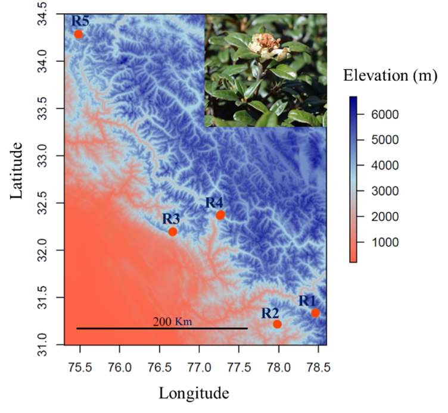

Ability of plant species to adapt along natural gradients.

Map showing the study area in Western Himalaya with five distant regions (R1 to R5). Region 5 is the coldest and driest and region 3 is the wettest and warmer also. Photo in the upper right shows Rhododendron anthopogon, the focal species. Each region, includes three populations along elevation gradient (lower limit, mid and higher limit). 

The major aim of the proposal is to obtain novel insights into the ability of plant species to adapt to changing climatic conditions by exploring their functional differentiation along natural gradients. Specifically, I propose to elucidate adaptive strategies of long-lived shrub-line forming species with contrasting strategies to changing climatic conditions (in natural experimental settings). The study will allow disentangling the independent and combined effects of temperature and water availability on functional traits (morphological and biochemical) without confounding effects of other factors. The study will also enable to analyse the direction and magnitude of shift in trait values (as per trait driver theory) along climatic gradients and elucidate the relative role of various factors (e.g. climatic, spatial, organisational) causing functional trait variability (e.g. intra-individual to inter-population). We will get insights into specific traits that are favoured at particular climate (e.g. at colder and drier, colder and wet etc.). Further, combination gradients and virtual transplant experiment will allow to verify the direct link between species traits and climatic conditions, at short and long temporal scales, respectively. In addition, the project will allow to test if the functional responses of single species to climatic variability can be generalized to whole communities.
